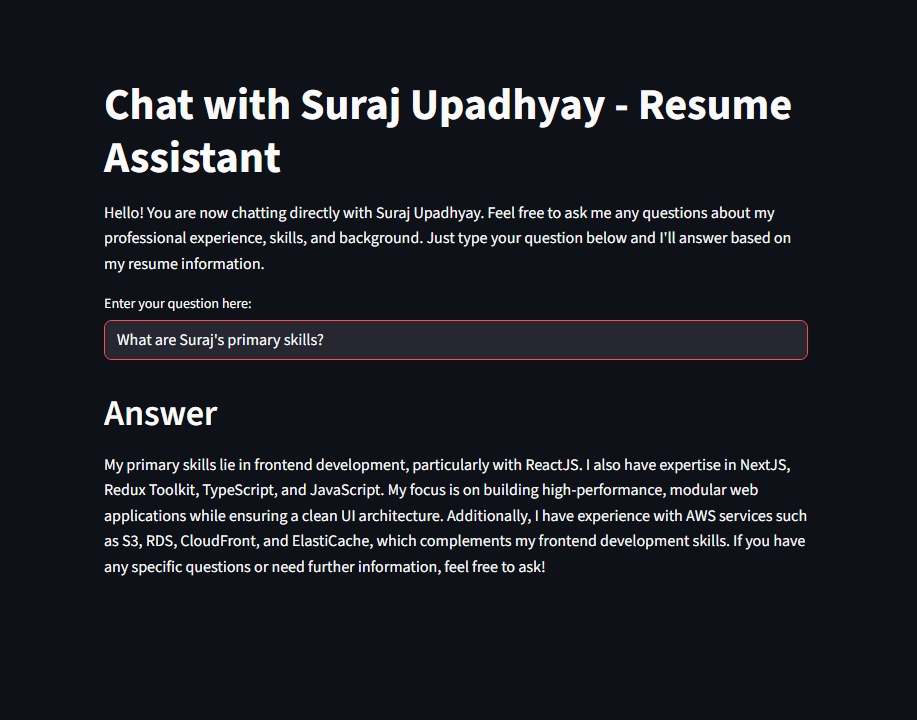

# AI-based Resume QnA Application

## Project Description
This is a learning project where I have built an AI-based Question and Answer (QnA) application over my resume/CV. The application allows users to interactively ask questions about my professional experience, skills, and background, and receive answers generated by an AI model based on the information in my resume.


## Demo
You can access the live demo of this project hosted on Streamlit Community Cloud at the following URL:

[https://suraj0004-my-resume-based-ai-qna-main-s8uk44.streamlit.app/](https://suraj0004-my-resume-based-ai-qna-main-s8uk44.streamlit.app/)


## Screenshot




## Features / Overview
- Interactive chat interface built with Streamlit.
- AI-powered QnA using OpenAI's GPT-4o-mini model.
- Uses Langchain framework for building the QnA chain.
- Vector search implemented with FAISS for efficient retrieval of relevant resume data.
- Answers are provided in a friendly, clear, and professional tone as if I am responding personally.

## How It Works
- The resume data is stored in a CSV file (`suraj_resume_qna.csv`) containing questions and answers.
- A vector database is created from the CSV data using FAISS and OpenAI embeddings.
- When a user asks a question, the system retrieves relevant context from the vector database.
- The retrieved context and the question are passed to the GPT-4o-mini model via Langchain's RetrievalQA chain.
- The model generates an answer based on the context, simulating a conversation with me.

## Installation and Setup

### Requirements
- Python 3.7 or higher
- Install dependencies listed in `requirements.txt`

### Setting OpenAI API Key
- Obtain an OpenAI API key from [OpenAI](https://platform.openai.com/account/api-keys).
- Set the API key in the `secret.py` file as `OPENAI_API_KEY`.

### Running the Application
1. Install dependencies:
   ```
   pip install -r requirements.txt
   ```
2. Run the Streamlit app:
   ```
   streamlit run main.py
   ```
3. Open the provided local URL in your browser to start chatting with the resume assistant.

## File Descriptions
- `main.py`: Streamlit app providing the chat interface.
- `langchain_helper.py`: Contains logic for creating the vector database and querying the AI model.
- `suraj_resume_qna.csv`: CSV file containing resume questions and answers used to build the vector database.
- `secret.py`: Stores the OpenAI API key (not included in version control).
- `requirements.txt`: Python dependencies for the project.

## Usage Instructions
- Enter your question about my resume in the input box.
- The AI will respond with an answer based on the resume data.
- Feel free to ask about my skills, experience, projects, or any other professional details.

## License / Author
Created by Suraj Upadhyay as a personal learning project.
